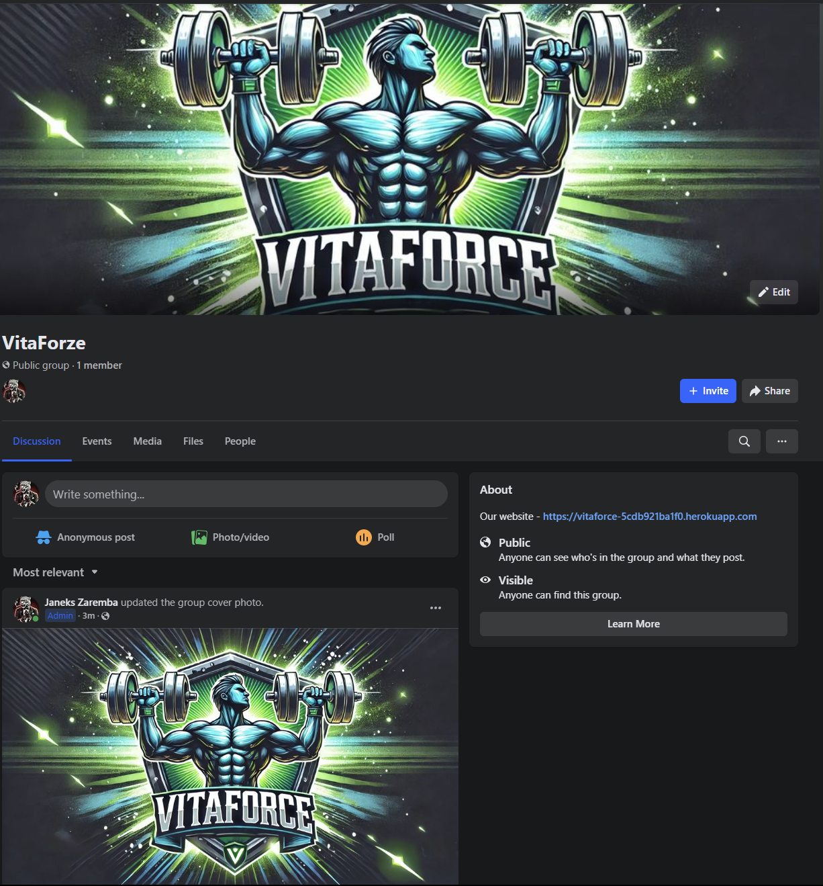
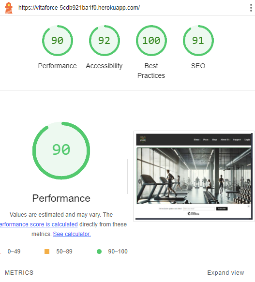

# VitaForce

## Description
VitaForce is a modern and dynamic fitness platform designed to help users achieve their personal fitness goals through custom workout and nutrition plans. The platform also features a fully functional e-commerce system where users can purchase plans, supplements, and fitness equipment. VitaForce was built with both fitness enthusiasts and professionals in mind, allowing for easy access to personalized fitness plans and related products, all in one place.

## Features
- **Custom Plans**: Users can choose between various **Workout** and **Nutrition** plans tailored to their individual fitness goals.
- **E-commerce Shop**: Full e-commerce functionality, allowing users to browse and purchase products related to nutrition, supplements, and exercise equipment.
- **Account Management**: Users can manage their accounts, track their purchases, review and update their fitness plans, and write posts about their progress.
- **Admin Panel**: Admins can add, edit, and delete plans and products, manage user data, and oversee shop management. Admins can also view logs related to user activities such as purchases and profile edits.
- **User Reviews and Ratings**: Users can leave reviews and rate the products or plans they purchase, helping others make informed decisions.
- **Community Posts**: Users can share their experiences and progress through community posts visible to all members.
- **Newsletter Signup**: Users can subscribe to receive newsletters and updates on new fitness plans or promotions.
- **SEO Optimization**: Fully optimized for search engines with proper meta tags, robots.txt, and sitemap.xml for better discoverability.
- **404 Page**: A user-friendly custom 404 error page with navigation options.

## Features to be Implemented
- **Live Chat Support**: A live chat system for customer support and inquiries.
- **Progress Tracker**: A feature that tracks user progress through various workout stages and nutritional goals.
- **Custom Challenges**: Users will be able to participate in community-driven challenges or create their own.
- **Mobile App**: A dedicated mobile app to enhance user experience on mobile devices.

## Technologies Used
- **Frontend**: HTML, CSS, JavaScript, Bootstrap
- **Backend**: Python, Django
- **Database**: MySQL
- **Version Control**: GitHub
- **Deployment**: Heroku
- **Payments**: Stripe API for secure online transactions

## Fixed Bugs
- **Login Redirects**: Fixed issues where users were not redirected properly after logging in or signing up.
- **Cart Quantity Updates**: Fixed an issue where cart quantities were not updating correctly.
- **Admin Dashboard Access**: Resolved a problem where some admin functionalities were not properly restricted to admin users only.

## SEO Enhancements
- **robots.txt**: Configured to allow search engines to index the site efficiently.
- **sitemap.xml**: Contains structured data for all important pages to improve site crawling.
- **Meta Tags**: Added meta descriptions to key pages for better search engine visibility.
- **404 Page**: Custom 404 page ensures users are redirected to meaningful content.

## Wireframes
Wireframes were created to visualize the layout and functionality of the website on different devices. You can view these wireframes for the following pages:

1. **Home Page**
   - Features a welcoming introduction and links to key sections like Plans, Shop, About Us, and Support. The page is designed to be visually appealing, showcasing top plans and products.
   
2. **Plans Page**
   - A detailed overview of the fitness and nutrition plans. Users can browse various plans, view detailed descriptions, and purchase directly from this page.

3. **Shop Page**
   - Displays all products related to fitness, such as supplements and workout equipment. Users can filter products by category and tag (e.g., New, Popular).

4. **About Us Page**
   - Provides information about the VitaForce brand, its mission, and the team behind the platform. This page emphasizes the platform's commitment to quality fitness plans.

5. **Support Page**
   - A simple, user-friendly page that helps users get in touch with support, access FAQs, or browse helpful resources.

## UX Design
The user experience (UX) design of VitaForce focuses on ease of navigation, simplicity, and a modern aesthetic to ensure users can quickly find and access the fitness plans or products they need. The design was created with mobile responsiveness in mind, ensuring users have a seamless experience across devices like phones, tablets, laptops, and desktops.

## Deployment
### Remote (Heroku)

1. Create an account at [Heroku](https://www.heroku.com/).
2. Download CLI [here](https://devcenter.heroku.com/articles/getting-started-with-python#set-up).
3. Open CMD (Windows) or Terminal (MacOS) and log in using `heroku login`.
4. Create a new Heroku app using `heroku create app-name-here`.
5. Modify the `ALLOWED_HOSTS` in the `settings.py` file to include your Heroku app name.
6. Add environment variables in Heroku under the Settings tab:
   - `DATABASE_NAME`, `DATABASE_USER`, `DATABASE_PASSWORD`, `DATABASE_HOST`, `DATABASE_PORT`, `SECRET_KEY`, `STRIPE_KEYS`
7. Set the Heroku stack to container with `heroku stack:set container -a app-name-here`.
8. Create a PostgreSQL database with `heroku addons:create heroku-postgresql:hobby-dev -a app-name-here`.
9. Push the code to Heroku using `git push heroku master`.
10. Run migrations with `heroku run python manage.py migrate`.
11. Create a superuser with `heroku run python manage.py createsuperuser`.

## Testing
### Manual Testing
- Verified that all forms provide appropriate validation messages.
- Confirmed that the e-commerce payment system correctly handles both successful and failed payments.
- Checked navigation links to ensure there are no broken links across the website.
- Tested 404 error handling for non-existent pages.

### Automated Testing
- Used Django's built-in testing framework to validate models and views.
- Wrote unit tests for core functionalities, such as CRUD operations and payment processing.

## Social Media

VitaForce is active on social media to engage with our users and provide updates. You can follow us on Facebook for the latest news, fitness tips, and product updates.

- **Facebook Page**: [VitaForce on Facebook](https://www.facebook.com/groups/517274627725346) 

Stay connected and be part of the growing VitaForce community!

## Credits

### Content
- **Django Documentation**: [https://docs.djangoproject.com/](https://docs.djangoproject.com/)
  - The official Django documentation was helpful in setting up models, views, and the overall structure of the project.
  
- **Bootstrap Documentation**: [https://getbootstrap.com/docs/](https://getbootstrap.com/docs/)
  - Bootstrap's documentation guided the styling and layout for responsive design.
  
- **Stripe API Documentation**: [https://stripe.com/docs](https://stripe.com/docs)
  - Used for implementing secure online payments on the platform.
  
- **MySQL Documentation**: [https://dev.mysql.com/doc/](https://dev.mysql.com/doc/)
  - The official MySQL documentation was used to understand and configure the database for the project.

- **Heroku Documentation**: [https://devcenter.heroku.com/](https://devcenter.heroku.com/)
  - Heroku's official documentation helped with the deployment of the application.

- **MailChimp API Documentation**: [https://mailchimp.com/developer/](https://mailchimp.com/developer/)
  - This documentation provided insights for integrating a newsletter subscription form.

- **GitHub**: [https://github.com/](https://github.com/)
  - Version control and repository management were done through GitHub.

- **Python Requests Documentation**: [https://docs.python-requests.org/](https://docs.python-requests.org/)
  - Used for integrating third-party APIs and making HTTP requests.
  
- **Font Awesome Icons**: [https://fontawesome.com/](https://fontawesome.com/)
  - The icons used in the site's footer and other sections were sourced from Font Awesome.

- **Cloudinary** (Optional if used): [https://cloudinary.com/documentation](https://cloudinary.com/documentation)
  - For managing and delivering media assets efficiently across the web.

- **Django REST Framework**: [https://www.django-rest-framework.org/](https://www.django-rest-framework.org/)
  - Helped in setting up the API for future mobile app integration.

- **Stack Overflow**: [https://stackoverflow.com/](https://stackoverflow.com/)
  - A helpful resource for troubleshooting issues and understanding various aspects of coding.

### Accessibility

### Media
- [Favocons](https://favicon.io) - Used for creating the favicon for the site.
- [Pngegg](https://www.pngegg.com) - Used for downloading the images used in the site. (e.g., the hero image)
- [Flaticon](https://www.flaticon.com) - Used for downloading the icons used in the site.
- DALL·E image generation tool - Used for generating the images used in the site on the main page on the banner section and the logo.

Throughout the development of VitaForce, various online resources and references were used to ensure best practices, modern coding techniques, and industry-standard functionalities.

### YouTube Channels:
- **[Traversy Media](https://www.youtube.com/c/TraversyMedia)** – This channel provided great insights on web development, specifically Django and e-commerce projects.
- **[The Net Ninja](https://www.youtube.com/c/TheNetNinja)** – Their tutorials on full-stack development and Django helped me with implementing both user and admin functionalities.
- **[Academind](https://www.youtube.com/c/Academind)** – Their channel was useful for better understanding complex concepts related to Python and JavaScript frameworks.
- **[CS50 by Harvard University](https://www.youtube.com/c/cs50)** – Their foundational lessons on full-stack development and project deployment were essential in shaping this project.
- **[CodingEntrepreneurs](https://www.youtube.com/c/CodingEntrepreneurs)** – Detailed tutorials on Django and Python were incredibly helpful, especially when it came to setting up deployment strategies and improving the backend of the site.

### Other References:
- Django Official Documentation: [https://docs.djangoproject.com/](https://docs.djangoproject.com/)
- MDN Web Docs (HTML/CSS/JavaScript): [https://developer.mozilla.org/](https://developer.mozilla.org/)
- Bootstrap Documentation: [https://getbootstrap.com/docs/](https://getbootstrap.com/docs/)
