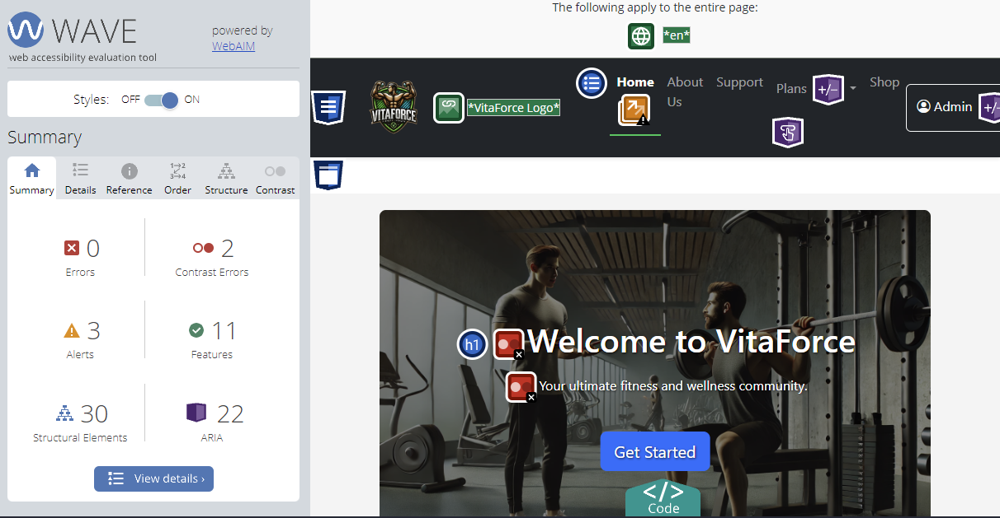

# VitaForce

Developer: Janeks Zaremba

💻[Visit Live Website](https://vitaforce.herokuapp.com/)


## Description
VitaForce is a modern and dynamic fitness platform designed to help users achieve their personal fitness goals through custom workout and nutrition plans. The platform also features a fully functional e-commerce system where users can purchase plans, supplements, and fitness equipment. VitaForce combines simplicity, functionality, and design to cater to fitness enthusiasts and professionals alike.

---
## Table of Contents

- [VitaForce](#vitaforce)
  - [Description](#description)
  - [Table of Contents](#table-of-contents)
  - [Key Features](#key-features)
    - [User Features](#user-features)
    - [Admin Features](#admin-features)
  - [Technical Details](#technical-details)
    - [Technologies Used](#technologies-used)
  - [Fixed/Unfixed Bugs](#fixedunfixed-bugs)
  - [Testing and Validation](#testing-and-validation)
    - [Lighthouse Screenshots](#lighthouse-screenshots)
    - [WAVE Accessibility Testing Results](#wave-accessibility-testing-results)
    - [Coverage Results](#coverage-results)
  - [Testing](#testing)
    - [Manual Testing of User Stories](#manual-testing-of-user-stories)
    - [Testing Methodology](#testing-methodology)
  - [Wireframes](#wireframes)
    - [Home Page](#home-page)
    - [Plans Page](#plans-page)
    - [Shop Page](#shop-page)
    - [Support Page](#support-page)
    - [Checkout Page](#checkout-page)
    - [User Profile Page](#user-profile-page)
    - [Admin Dashboard](#admin-dashboard)
  - [Deployment Instructions](#deployment-instructions)
    - [Local Setup](#local-setup)
  - [Deployment](#deployment)
    - [Remote (Heroku)](#remote-heroku)
  - [Social Media](#social-media)
  - [SEO and Accessibility](#seo-and-accessibility)
  - [Future Enhancements](#future-enhancements)
  - [Credits](#credits)
    - [Media](#media)
    - [YouTube Channels:](#youtube-channels)
    - [Other References:](#other-references)


## Key Features

### User Features
- **Custom Plans**: Personalized workout and nutrition plans tailored to individual goals.
- **E-commerce Shop**: Browse and purchase products like supplements and exercise equipment.
- **Account Management**: Users can manage purchases, review fitness plans, and share progress through posts.
- **Community Interaction**: Share experiences, rate products, and participate in discussions.
- **Newsletter Signup**: Receive updates about new plans, products, and promotions.
- **Responsive Design**: Fully optimized for use on mobile, tablet, and desktop.

### Admin Features
- **Product Management**: Add, edit, and remove products.
- **Plan Management**: Manage workout and nutrition plans.
- **User Moderation**: Control user access and roles, handle support requests.
- **Analytics**: Track user activity, sales, and reviews (future feature).

---

## Technical Details

### Technologies Used
- **Frontend**: HTML, CSS, JavaScript, Bootstrap
- **Backend**: Python, Django Framework
- **Database**: MySQL
- **Payment System**: Stripe for secure transactions
- **Hosting**: Heroku
- **Version Control**: GitHub

---

## Fixed/Unfixed Bugs

| **Bug Description**                                    | **Status**   | **Resolution/Fix**                                                                                  |
|--------------------------------------------------------|--------------|------------------------------------------------------------------------------------------------------|
| Admin Panel Access                                     | Fixed        | Role-based access control implemented to restrict unauthorized access.                              |
| TinyMCE Editor Not Displaying                          | Unfixed        | creates a project error when integrated into pages                                                |
| Static Files Not Loading in Production                 | Fixed        | Adjusted `STATIC_ROOT` and ran `collectstatic`.                                                     |
| Login Redirect Bug                                     | Fixed        | Updated login view to include proper redirect based on user roles and location.                     |
| Cart Quantity Update Issue                             | Fixed        | Implemented frontend JS for dynamic updates and backend recalculation.                              |
| Admin Access Control                                   | Fixed        | Enhanced middleware and view-based role validation to restrict access.                              |
| Stripe Payment Failures                                | Fixed        | Improved error handling and feedback for users during payment failures.                             |
| 404 Error Handling                                     | Fixed        | Custom `404.html` template created for better user experience.                                      |
| SEO Meta Tagging                                       | Fixed        | Added meta descriptions dynamically via Django templates.                                           |
| Form Validation                                        | Fixed        | Implemented both backend (Django forms) and frontend (JS) validation for better UX.                 |
| Reviews and Posts Scrolling Issue                     | Fixed        | Added CSS scrollable container for better display of long content.                                  |
| TinyMCE Text Display Issue on Pages                   | Fixed        | Used `|safe` filter in Django templates to allow rendering of HTML content safely.                    |
| Incorrect Redirect After Payment                      | Unfixed      | Payment completes, but users see an error message instead of confirmation.                         |
| User Form Fields Allowed Invalid Data                 | Fixed        | Integrated real-time frontend validation and Django backend checks.                                 |
| Payment History Not Updating After Transaction        | Fixed        | Debugged and corrected database transaction logic and added user-specific query filters.            |
| Admin Edit/Delete Posts and Reviews URL Issues        | Fixed        | Fixed reverse URL errors by properly defining named URLs in the `urls.py` file.                    |
| Navbar Responsiveness on Mobile Devices               | Fixed        | Reworked CSS and JavaScript to improve the mobile responsiveness of the navigation bar.             |
| Support Requests Unorganized                          | Fixed        | Added structured admin view to list, edit, and mark requests as resolved.                           |
| Product Images Not Loading Properly                   | Fixed        | Resolved by ensuring correct static file paths and adding placeholders for missing images.          |
| Page Load Times Were Slow                              | Fixed        | Optimized static files and reduced unused CSS/JS for faster load times.                             |
| Pagination for Posts/Reviews                          | Fixed        | Integrated Django pagination for large lists of posts and reviews.                                  |
| Facebook Link in Footer                               | Fixed        | Added a clickable Facebook icon with a nofollow tag for proper external linking.                    |
| Reviews Allowed HTML Injection                        | Fixed        | Added proper escaping and validation to prevent malicious HTML inputs.                              |
| Admin Dashboard Missing Reviews/Posts Management      | Fixed        | Created dedicated admin views and templates for managing posts and reviews.                         |
| Calorie Calculator Not Returning Accurate Results     | Fixed        | Corrected formula logic and added validation for user inputs.                                       |
| Trial Notification Missing                            | Fixed        | Added a notification system to alert users when their trial is about to expire.                     |
| Light/Dark Mode Switch UI Inconsistent                | Fixed        | Improved the toggle button UI for switching between light and dark modes.                           |
| Footer Design Overlap                                 | Fixed        | Adjusted footer CSS for better responsiveness and design clarity.                                   |
| Error Handling for Unhandled Exceptions               | Fixed        | Implemented global error handling and customized error pages.                                       |
| Payment Status Confusion                              | Unfixed      | Payment sometimes shows errors even when successfully completed; requires additional debugging.     |
| User Profile Updates Not Saving                       | Fixed        | Resolved by updating the form submission logic and fixing database constraints.                     |
| Multilingual Content Support                          | Fixed        | Added support for multiple languages in posts and reviews.                                          |

---

## Testing and Validation

| **Test/Validation Type**       | **Tools Used**           | **Tested** | **Result** |
|----------------------------|--------------------------|------------|------------|
| **Accessibility**          | Lighthouse, WAVE         | ✅         | Passed     |
| **SEO**                    | Lighthouse, Screaming Frog | ✅         | Passed     |
| **Performance**            | Lighthouse               | ✅         | Passed     |
| **404 Error Handling**     | Manual Testing           | ✅         | Passed     |
| **E-commerce Functionality**| Manual Testing           | ✅         | Passed     |
| **Forms Validation**       | Django Built-in Validators | ✅         | Passed     |
| **Cross-device Compatibility**| Manual Testing, BrowserStack | ✅         | Passed     |
| **Mobile Responsiveness**   |  Chrome DevTools, Lighthouse   | ✅         | Passed     |

### Lighthouse Screenshots
- **Lighthouse Home Page Report**: 
- **Lighthouse About Us Page**: 
- **Lighthouse Support Page**: 
- **Lighthouse Exercise Plan Page**: 
- **Lighthouse Nutrition Plan Page**: 
- **Lighthouse Shop Page Report**: 
- **Lighthouse Profile Page**: 
- **Lighthouse Settings Page**: 
- **Lighthouse Cart Page**: 
- **Lighthouse Order History Page**: 
- **Lighthouse My Post/Review Page**: 
- **Lighthouse 404 Page**: 


### WAVE Accessibility Testing Results

The WAVE WebAIM web accessibility evaluation tool was used to test various pages of the website. The tool identified some issues that were fixed during the development process, ensuring that all pages meet accessibility standards. Below are the final WAVE accessibility test results for the key pages:

- **Home Page Accessibility Report**: 
- **About Us Page Accessibility Report**: 
- **Support Page Accessibility Report**: 
- **Exercise Plan Page Accessibility Report**: 
- **Nutrition Plan Page Accessibility Report**: 
- **Shop Page Accessibility Report**: 

These results demonstrate the website's commitment to providing an accessible and inclusive user experience.

### Coverage Results
- **Coverage Report**: 

## Testing

### Manual Testing of User Stories

| **User Story**                                | **Tested** | **Result**            |
|-----------------------------------------------|------------|-----------------------|
| User can view the homepage and navigate easily | ✅         | Works as expected    |
| User can register a new account               | ✅         | Works as expected    |
| User can log in and log out                   | ✅         | Works as expected    |
| User can update their profile                 | ✅         | Works as expected    |
| User can view products in the shop            | ✅         | Works as expected    |
| User can add items to the cart                | ✅         | Works as expected    |
| User can remove items from the cart           | ✅         | Works as expected    |
| User can complete a purchase                  | ✅         | Works as expected    |
| User can view their order history             | ✅         | Works as expected    |
| User can rate and review products             | ✅         | Works as expected    |
| User can contact support via a form           | ✅         | Works as expected    |
| Admin can manage users (edit, ban/unban)      | ✅         | Works as expected    |
| Admin can add, edit, and delete products      | ✅         | Works as expected    |
| Admin can view all purchase logs              | ✅         | Works as expected    |
| Admin can respond to support requests         | ⬜️         | Partial functionality   |
| Admin can mark support requests as completed or not | ✅    | Works as expected |
| Responsive design works on all devices        | ✅         | Works as expected    |


### Testing Methodology
- **Accessibility**: WAVE, Chrome Developer Tools, Lighthouse
- **SEO**: Google Search Console, Lighthouse
- **Performance**: Google PageSpeed Insights, Lighthouse
- **404 Error Handling**: Manual Testing
- **E-commerce Functionality**: Manual Testing
- **Forms Validation**: Django Built-in Validators
- **Cross-device Compatibility**: Manual Testing, BrowserStack
- **Mobile Responsiveness**: Chrome DevTools, Lighthouse

---

## Wireframes

### Home Page
The homepage serves as the entry point for the VitaForce website, showcasing an intuitive navigation bar, featured products, user plans, and an introduction to the platform's services. The design includes:
- A **hero section** with a prominent call-to-action and links to explore plans or shop products.
- Navigation with links to **Home**, **Plans**, **Shop**, **Support**, and **Login/Signup**.
- Responsive layout for all device sizes, ensuring usability on mobile, tablet, and desktop.

*(This plan may change as the project evolves.)*

### Plans Page
The plans page presents users with detailed options for **Nutrition** and **Workout** plans:
- A **dropdown menu** to toggle between Nutrition and Workout plans.
- Plan details including name, description, duration, and price.
- Options for adding plans to the cart.

*(This plan may change as the project evolves.)*

### Shop Page
The shop page provides e-commerce functionality, enabling users to browse, filter, and purchase products:
- Categories for **Nutrition** and **Exercise** products.
- Product listings with thumbnails, descriptions, and prices.
- A filter section to sort by **New**, **Popular**, or price ranges.
- Add-to-cart functionality with quantity adjustment.

*(This plan may change as the project evolves.)*

### Support Page
The support page includes:
- A **contact form** with fields for Name, Email, and Message.
- Dropdown to categorize the type of support request (e.g., Technical, Billing, Feedback).
- A frequently asked questions (**FAQ**) section.

*(This plan may change as the project evolves.)*

### Checkout Page
The checkout page allows users to review and finalize their purchases:
- A summary table listing items, quantity, price, and subtotal.
- A billing details form with fields for name, email, address, and ZIP code.
- Integration with **Stripe** for secure payment processing.

*(This plan may change as the project evolves.)*

### User Profile Page
The profile page includes:
- Sections for **Settings**, **My Purchases**, and **Posts**.
- Options for updating email, password, and notification preferences.
- A display of purchased plans and transaction history.

*(This plan may change as the project evolves.)*

### Admin Dashboard
The admin dashboard facilitates the management of:
- **Users**: Edit, ban/unban, and change user roles.
- **Products**: Add, edit, delete products in the shop.
- **Plans**: Manage Nutrition and Workout plans.
- **Support Requests**: View, respond, and mark requests as resolved.
- **Logs**: Track user actions and site activity for monitoring.

*(This plan may change as the project evolves.)*

All wireframes were designed to ensure a seamless user experience across devices, with a consistent design language and functional layout.


## Deployment Instructions

### Local Setup
1. **Clone the Repository**:
   ```bash
   git clone https://github.com/your-repository/vitaforce.git
   cd vitaforce
   ```
2. **Install Dependencies**:
   ```bash
   pip install -r requirements.txt
   ```
3. **Environment Configuration**:
   - Create a `.env` file with keys for SECRET_KEY, Stripe keys, and database credentials.
4. **Run Migrations**:
   ```bash
   python manage.py migrate
   ```
5. **Start the Server**:
   ```bash
   python manage.py runserver
   ```

## Deployment
### Remote (Heroku)

1. Create an account at [Heroku](https://www.heroku.com/).
2. Download CLI [here](https://devcenter.heroku.com/articles/getting-started-with-python#set-up).
3. Open CMD (Windows) or Terminal (MacOS) and log in using `heroku login`.
4. Create a new Heroku app using `heroku create app-name-here`.
5. Modify the `ALLOWED_HOSTS` in the `settings.py` file to include your Heroku app name.
6. Add environment variables in Heroku under the Settings tab:
   - `DATABASE_NAME`, `DATABASE_USER`, `DATABASE_PASSWORD`, `DATABASE_HOST`, `DATABASE_PORT`, `SECRET_KEY`, `mybookingr35t`
7. Set the Heroku stack to container with `heroku stack:set container -a app-name-here`.
8. Create a PostgreSQL database with `heroku addons:create heroku-postgresql:hobby-dev -a app-name-here`.
9. Push the code to Heroku using `git push heroku master`.
10. Run migrations with `heroku run python manage.py migrate`.
11. Create a superuser with `heroku run python manage.py createsuperuser`.


## Social Media

VitaForce is active on social media to engage with our users and provide updates. You can follow us on Facebook for the latest news, fitness tips, and product updates.

- **Facebook Page**: [-----> VitaForce on Facebook <-----](https://www.facebook.com/groups/517274627725346)

Stay connected and be part of the growing VitaForce community!


---

## SEO and Accessibility
- **robots.txt** and **sitemap.xml**: Configured for better search engine indexing.
- **Meta Descriptions**: Present on key pages to enhance discoverability.
- **WAVE Report**: Verified all interactive elements and labels for accessibility.

---

## Future Enhancements
- **Live Chat Support**: A chat feature for real-time support.
- **Mobile App**: A dedicated application for iOS and Android.
- **Progress Tracker**: Track progress through workouts and nutrition goals.
- **Custom Challenges**: Community-driven fitness challenges.

---

## Credits
- **Django Documentation**: [https://docs.djangoproject.com/](https://docs.djangoproject.com/)
  - The official Django documentation was helpful in setting up models, views, and the overall structure of the project.
  
- **Bootstrap Documentation**: [https://getbootstrap.com/docs/](https://getbootstrap.com/docs/)
  - Bootstrap's documentation guided the styling and layout for responsive design.
  
- **Stripe API Documentation**: [https://stripe.com/docs](https://stripe.com/docs)
  - Used for implementing secure online payments on the platform.
  
- **MySQL Documentation**: [https://dev.mysql.com/doc/](https://dev.mysql.com/doc/)
  - The official MySQL documentation was used to understand and configure the database for the project.

- **Heroku Documentation**: [https://devcenter.heroku.com/](https://devcenter.heroku.com/)
  - Heroku's official documentation helped with the deployment of the application.

- **MailChimp API Documentation**: [https://mailchimp.com/developer/](https://mailchimp.com/developer/)
  - This documentation provided insights for integrating a newsletter subscription form.

- **GitHub**: [https://github.com/](https://github.com/)
  - Version control and repository management were done through GitHub.

- **Python Requests Documentation**: [https://docs.python-requests.org/](https://docs.python-requests.org/)
  - Used for integrating third-party APIs and making HTTP requests.
  
- **Font Awesome Icons**: [https://fontawesome.com/](https://fontawesome.com/)
  - The icons used in the site's footer and other sections were sourced from Font Awesome.

- **Cloudinary** (Optional if used): [https://cloudinary.com/documentation](https://cloudinary.com/documentation)
  - For managing and delivering media assets efficiently across the web.

- **Django REST Framework**: [https://www.django-rest-framework.org/](https://www.django-rest-framework.org/)
  - Helped in setting up the API for future mobile app integration.

- **Stack Overflow**: [https://stackoverflow.com/](https://stackoverflow.com/)
  - A helpful resource for troubleshooting issues and understanding various aspects of coding.

- **VS Code**: [https://code.visualstudio.com/](https://code.visualstudio.com/)
  - The integrated development environment used for editing and managing the project files.

- **Pylance**: [https://marketplace.visualstudio.com/items?itemName=ms-python.vscode-pylance](https://marketplace.visualstudio.com/items?itemName=ms-python.vscode-pylance)
  - Provided code intelligence and type checking for Python in VS Code.

- **Postman**: [https://www.postman.com/](https://www.postman.com/)
  - Used for testing API endpoints and debugging HTTP requests during development.

- **Google Fonts**: [https://fonts.google.com/](https://fonts.google.com/)
  - Fonts used across the website for typography enhancements.

- **OpenWeather API** (if relevant): [https://openweathermap.org/api](https://openweathermap.org/api)
  - Integrated for providing weather updates in user dashboard or community updates.

- **Django Messages Framework**: [https://docs.djangoproject.com/en/5.0/ref/contrib/messages/](https://docs.djangoproject.com/en/5.0/ref/contrib/messages/)
  - Utilized for implementing user notifications and alerts.

- **Python Decouple**: [https://pypi.org/project/python-decouple/](https://pypi.org/project/python-decouple/)
  - Used for managing environment variables securely in `.env` files.


### Media
- [Favocons](https://favicon.io) - Used for creating the favicon for the site.
- [Pngegg](https://www.pngegg.com) - Used for downloading the images used in the site. (e.g., the hero image)
- [Flaticon](https://www.flaticon.com) - Used for downloading the icons used in the site.
- DALL·E image generation tool - Used for generating the images used in the site on the main page on the banner section and the logo.

### YouTube Channels:
- **[Traversy Media](https://www.youtube.com/c/TraversyMedia)** – This channel provided great insights on web development, specifically Django and e-commerce projects.
- **[The Net Ninja](https://www.youtube.com/c/TheNetNinja)** – Their tutorials on full-stack development and Django helped me with implementing both user and admin functionalities.
- **[Academind](https://www.youtube.com/c/Academind)** – Their channel was useful for better understanding complex concepts related to Python and JavaScript frameworks.
- **[CS50 by Harvard University](https://www.youtube.com/c/cs50)** – Their foundational lessons on full-stack development and project deployment were essential in shaping this project.
- **[CodingEntrepreneurs](https://www.youtube.com/c/CodingEntrepreneurs)** – Detailed tutorials on Django and Python were incredibly helpful, especially when it came to setting up deployment strategies and improving the backend of the site.

### Other References:
- MDN Web Docs (HTML/CSS/JavaScript): [https://developer.mozilla.org/](https://developer.mozilla.org/)
- Bootstrap Documentation: [https://getbootstrap.com/docs/](https://getbootstrap.com/docs/)
